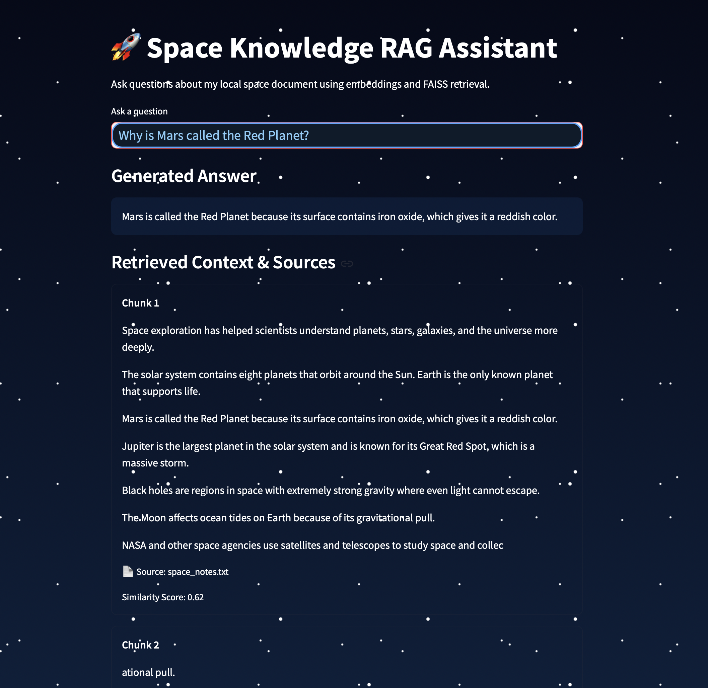
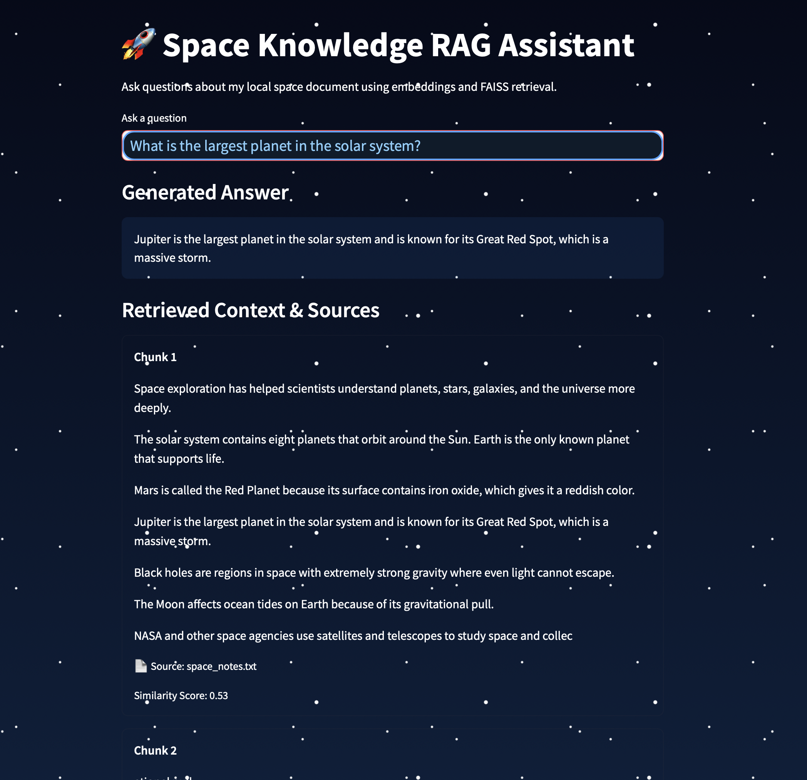

# 🚀 Space Knowledge RAG Assistant

A local RAG (Retrieval-Augmented Generation) assistant built using:

- Python
- Streamlit
- FAISS
- Sentence Transformers

## Features
- Ask questions from local documents
- Embedding-based retrieval
- Similarity score display
- Space-themed UI

## Example Questions

1. Why is Mars called the Red Planet?
2. What is the largest planet in the solar system?

## Screenshots

### Mars Question

### Jupiter Question

